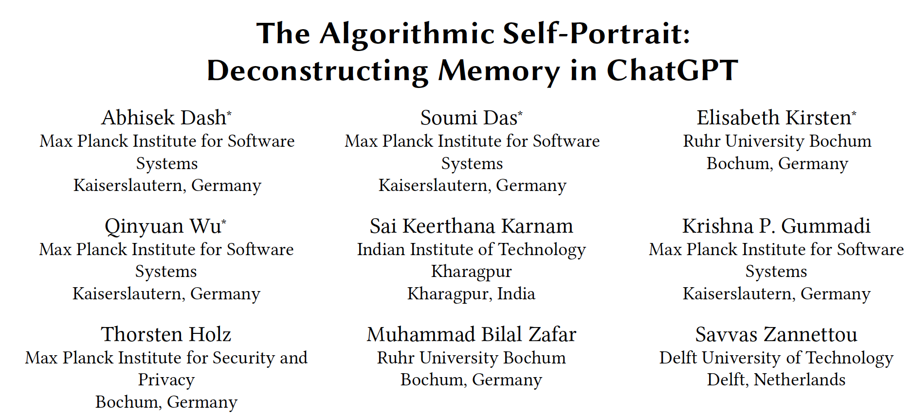
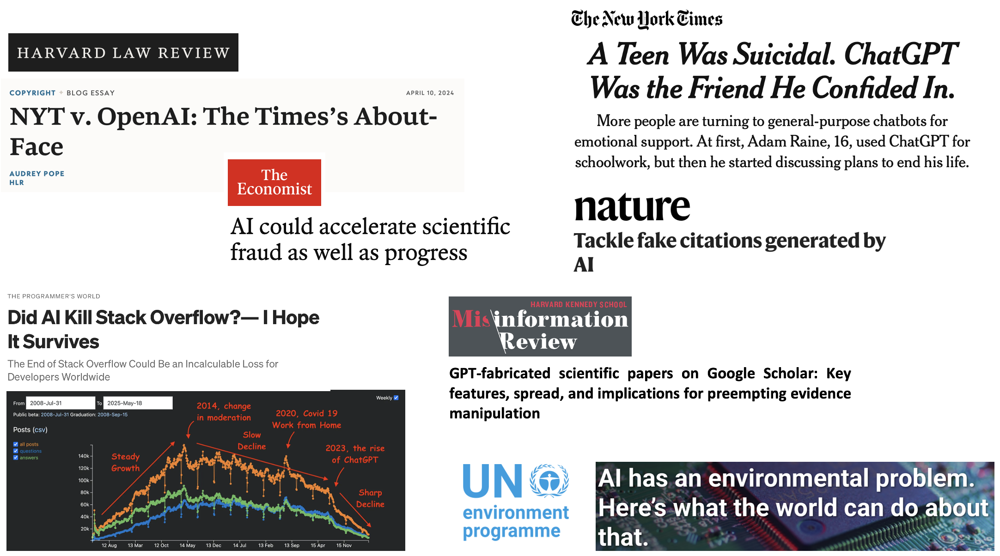
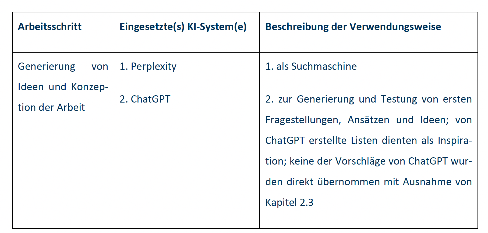

## Agenda for today

1. *R* warmup session

2. Use of generative AI


##


```{r, echo=FALSE, warning=FALSE, out.width="105%", message=FALSE}
#| html-table-processing: none

library(openxlsx)
library(tidyverse)
library(gt)
library(gtExtras)
read.xlsx("../material/data/schedule_in_slides.xlsx") %>%
    rename(`Required reading` = "Required.reading") %>%
    head(7) %>% 
    gt() %>%
    tab_header(md("**Seminar dates and topics**")) %>%
    #tab_header("**Seminar dates and topics**") %>%
    #fmt_markdown() %>% #columns = TRUE
    # cols_width(Date ~ px(400)#,
    #            #Topics ~ px(350)#,
    #            #`Required reading` ~ px(400)
    #            ) %>%
    cols_width(Date ~ pct(20),
               Topics ~ pct(30),
               `Required reading` ~ pct(50)
               ) %>%
    tab_options(data_row.padding = px(3)) %>%
    tab_options(heading.title.font.size = 14,
                column_labels.font.weight = "bold",
                table.font.size = 12) %>%
     gt_highlight_rows(
     rows = 3,
     fill = "lightblue"
   ) %>%
  fmt_markdown() %>% 
  cols_align(
    align = "left",
    columns = everything()
  )


```


# 1. *R* warmup session {background-color="#58748F"} 

## Let's start with some coding
- Go to [https://sebastianstier.com/ma_css26/material.html](https://sebastianstier.com/ma_css26/material.html)
- Continue in **1_tidyverse.R** 
- We will look at the homework and explore additional tidyverse functions


# 2. Use of generative AI {background-color="#58748F"} 


## The elephant in the room: AI, LLMs, ChatGPT et al.


{.figure width="710"}

::: {style="font-size: 26%;"}
University of Mannheim (2023). [ChatGPT im Studium.](https://www.uni-mannheim.de/media/Einrichtungen/Koordinationsstelle_Studieninformationen/Dokumente/Erstsemester/ChatGPT_Handreichung_Studierende_UMA_Stand_Mai_2023.pdf) [AI-generated English translation.](material/data/ChatGPT_Lehre_en.pdf) 


:::

## Think-pair-share

1. Discuss the **ChatGPT im Studium guide ** with 2-3 neighbors (5-7 min.)
2. How does AI threaten academic knowledge production?
3. Are the instructions provided by the Uni sufficiently clear to you?
4. Share and discuss your results with the full class


## The algorithmic self-portrait: Deconstructing memory in ChatGPT

{width=110%}


::: {style="font-size: 26%;"}
Dash, A., Das, S., Kirsten, E., Wu, Q., Karnam, S. K., Gummadi, K. P., Holz, T., Zafar, M. B., & Zannettou, S. (2026). The Algorithmic Self-Portrait: Deconstructing Memory in ChatGPT. [*arXiv*.](https://arxiv.org/abs/2602.01450)

:::


## Some problematic aspects of AI

{width=110%}


::: {style="font-size: 26%;"}
[https://harvardlawreview.org/blog/2024/04/nyt-v-openai-the-timess-about-face/](https://harvardlawreview.org/blog/2024/04/nyt-v-openai-the-timess-about-face/);  [https://medium.com/tech-ai-chat/did-ai-kill-stack-overflow-i-hope-it-survives-798f66d9a6da](https://medium.com/tech-ai-chat/did-ai-kill-stack-overflow-i-hope-it-survives-798f66d9a6da);  [https://www.nytimes.com/2025/08/26/technology/chatgpt-openai-suicide.html](https://www.nytimes.com/2025/08/26/technology/chatgpt-openai-suicide.html);
[https://www.nature.com/articles/d41586-025-02482-1](https://www.nature.com/articles/d41586-025-02482-1); 
[https://misinforeview.hks.harvard.edu/article/gpt-fabricated-scientific-papers-on-google-scholar-key-features-spread-and-implications-for-preempting-evidence-manipulation](https://misinforeview.hks.harvard.edu/article/gpt-fabricated-scientific-papers-on-google-scholar-key-features-spread-and-implications-for-preempting-evidence-manipulation); [https://www.economist.com/science-and-technology/2024/02/01/ai-could-accelerate-scientific-fraud-as-well-as-progress](https://www.economist.com/science-and-technology/2024/02/01/ai-could-accelerate-scientific-fraud-as-well-as-progress); [https://www.unep.org/news-and-stories/story/ai-has-environmental-problem-heres-what-world-can-do-about](https://www.unep.org/news-and-stories/story/ai-has-environmental-problem-heres-what-world-can-do-about)

:::


## Risks of AI in academic work I

::: {.fragment}

- Undesired outputs and bias: AI models may generate undesired or biased content based on the training data
- Lack of quality and factuality: Generated content may be incorrect or fabricated, a phenomenon referred to as "hallucination"
- Lack of timeliness: Models without real-time access cannot provide up-to-date information
- Lack of reproducibility and explainability: Outputs are often not reproducible and small changes in inputs can lead to large differences in outputs

::: {style="font-size: 40%;"}
[Risiken bei der Nutzung von KI-Systemen](https://ilias.uni-mannheim.de/ilias.php?baseClass=ilrepositorygui&ref_id=1663934)

:::

:::

## Risks of AI in academic work II

- Automation bias: Users might place too much trust in generated content
- The training dataset may contain unlawfully processed personal data or infringe on third-party intellectual property rights
- Outputs may unlawfully contain personal data or infringe on third-party intellectual property rights
- Generated content may be unlawful (e.g., offensive, incitement to hatred)
- Environmental impact

::: {style="font-size: 40%;"}
[Risiken bei der Nutzung von KI-Systemen](https://ilias.uni-mannheim.de/ilias.php?baseClass=ilrepositorygui&ref_id=1663934)


:::


## Potentials of AI in academic work

- Learning *critical* AI competencies and skills
- Summarizing content where completeness or 100% accuracy is not important
- Creating keywords and simple explanations for initial orientation
- Gaining a better understanding of a topic
- Structuring, lists and plans
- Clarifying your own ideas
- Receiving text feedback


::: {style="font-size: 40%;"}
[https://www.uni-mannheim.de/media/Einrichtungen/zll/Website_2.0/ChatGPT_Handreichung_Lehrende_UMA_Stand_Mai_2023.pdf](https://www.uni-mannheim.de/media/Einrichtungen/zll/Website_2.0/ChatGPT_Handreichung_Lehrende_UMA_Stand_Mai_2023.pdf)


:::

## Equal opportunities

{width=110%}


::: {style="font-size: 75%;"}
Uni Mannheim has a local implementation of ChatGPT: 
[ILIAS page "AI Students"](https://ilias.uni-mannheim.de/ilias.php?baseClass=ilrepositorygui&ref_id=1665656)
:::


## Recommendations I

::: {style="font-size: 85%;"}

- I am aware that I am responsible for the AI-generated output. I only use the output if I can assess its **legality** myself.
- I have read and observed the terms of use of the AI system. I know the **purposes for which I am permitted** to use the AI-generated output.
- I only enter **copyrighted material** (text, images, etc.) if I am authorized to do so, for example by obtaining prior permission from the copyright holder.
- I do **not enter secret or confidential information** unless there is an explicit regulation at my university for this purpose.
- I only enter **personal data** about myself or third parties into the AI system if I am certain that this is **lawful**. The same applies to querying such data from an AI system.

::: 

::: {style="font-size: 40%;"}
[ILIAS page "Selbstlernkurs"](https://ilias.uni-mannheim.de/ilias.php?baseClass=ilSAHSPresentationGUI&ref_id=1665926)

:::


## Recommendations II

::: {style="font-size: 85%;"}

- I have **anonymized or pseudonymized personal data** as far as possible before processing it with an AI system.
- If AI supports me in evaluations or decisions, I **document this transparently and take possible errors into account**. 
- Wherever appropriate and necessary, I **document the use of generative AI in a transparent manner**.
- I acknowledge that AI may generate outputs that closely resemble another work and may therefore be **considered plagiarism**.

::: 

::: {style="font-size: 40%;"}
[ILIAS page "Selbstlernkurs"](https://ilias.uni-mannheim.de/ilias.php?baseClass=ilSAHSPresentationGUI&ref_id=1665926)

:::

## Disclosure statement





::: {style="font-size: 40%;"}
[https://www.uni-mannheim.de/media/Einrichtungen/zll/Website_2.0/ChatGPT_Handreichung_Lehrende_Schriftliche_Arbeiten_Stand_Februar_2024.pdf](https://www.uni-mannheim.de/media/Einrichtungen/zll/Website_2.0/ChatGPT_Handreichung_Lehrende_Schriftliche_Arbeiten_Stand_Februar_2024.pdf)

:::

## How should I as an instructor deal with AI?

- Require disclosure statements
- Judge the quality of your submitted work
- Reproducing entire paragraphs or pages of text from an AI chatbot is not acceptable $\rightarrow$ I am good at spotting GPT-generated content
- I have presentations as a benchmark to contextualize your written work
- Appeal to you as students and life-long learners: using chatGPT in non-legitimate ways will not help you achieve the learning goals


# Thank you for your attention! See you on 4 March 2026 {background-color="#58748F"}

## References
