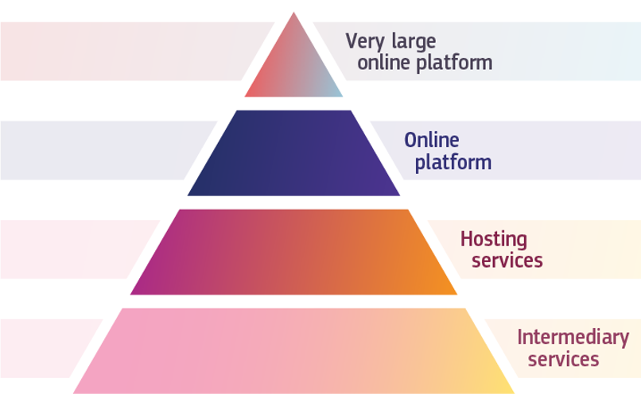
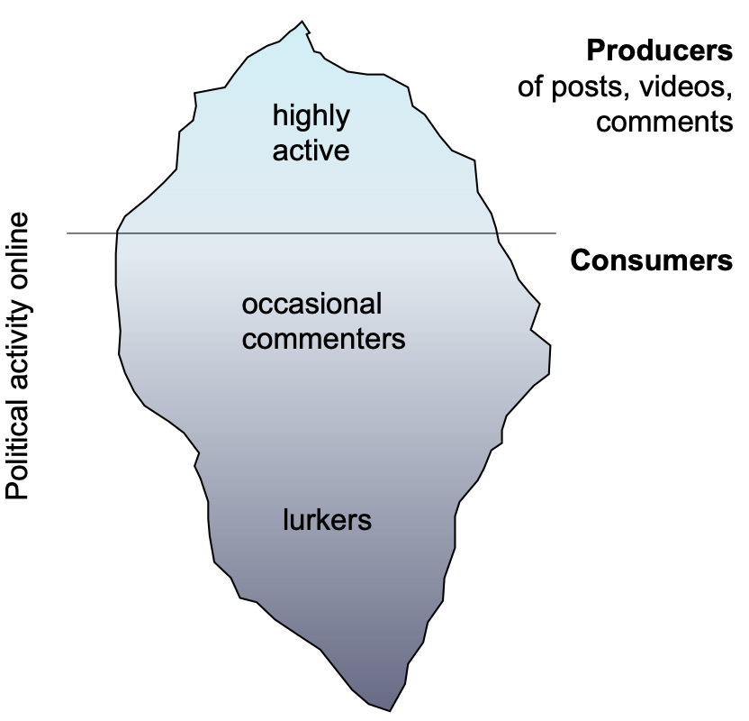

##

```{r, echo=FALSE, warning=FALSE, out.width="105%", message=FALSE}
#| html-table-processing: none

library(openxlsx)
library(tidyverse)
library(gt)
library(gtExtras)
read.xlsx("../material/data/schedule_in_slides.xlsx") %>%
    rename(`Required reading` = "Required.reading") %>%
    head(7) %>% 
    gt() %>%
    tab_header(md("**Seminar dates and topics**")) %>%
    #tab_header("**Seminar dates and topics**") %>%
    #fmt_markdown() %>% #columns = TRUE
    # cols_width(Date ~ px(400)#,
    #            #Topics ~ px(350)#,
    #            #`Required reading` ~ px(400)
    #            ) %>%
    cols_width(Date ~ pct(20),
               Topics ~ pct(30),
               `Required reading` ~ pct(50)
               ) %>%
    tab_options(data_row.padding = px(3)) %>%
    tab_options(heading.title.font.size = 14,
                column_labels.font.weight = "bold",
                table.font.size = 12) %>%
     gt_highlight_rows(
     rows = 5,
     fill = "lightblue"
   ) %>%
  fmt_markdown() %>% 
  cols_align(
    align = "left",
    columns = everything()
  )


```


## Agenda for today

1. *R* session with a focus on text processing and data visualization

2. Large online platforms and platform regulation

3. Introduction to web data collection and APIs


# 1. *R* session with a focus on text processing and data visualization {background-color="#58748F"}

## Introduction to *ggplot2*

:::: {.columns}

::: {.column width="57%"}

{width=120%}

::: {style="font-size: 28%;"}

[https://stulp.gmw.rug.nl/dataviz/ggplottheory.html](https://stulp.gmw.rug.nl/dataviz/ggplottheory.html)

:::

:::

::: {.column width="43%"}

- *ggplot2* follows the "grammar of graphics"
- [Cheatsheet](https://github.com/rstudio/cheatsheets/blob/main/data-visualization.pdf) with the most relevant functions
- [Extensions](https://exts.ggplot2.tidyverse.org/gallery/) to *ggplot2* that others built

:::

::::


## A ggplot figure

::: {.small-code}

```{r}
#| echo: fenced
#| output-location: column
#| code-line-numbers: "6|7|8|9|10"

library(ggplot2)
mtcars %>%
  ggplot(aes(x = disp, y = mpg)) +
  geom_point() +
  geom_smooth(method = "loess", formula = "y ~ x") +
  theme_minimal()

```

:::

## Let's start coding
- Go back to file **2_data_wrangling.R** from [https://sebastianstier.com/ma_css26/material.html](https://sebastianstier.com/ma_css25/material.html)


# 2. Large online platforms and platform regulation {background-color="#58748F"}


## Our two required readings


:::: {.columns}


::: {.column width="50%"}

{width=100%}

::: {style="font-size: 35%;"}

Pierri, F., Araujo, T., Kruikemeier, S., Lorenz-Spreen, P., Abeele, M. M. P. V., Vandenbosch, L., Gonçalves-Sa, J., & Grabowicz, P. A. (2025). Research Opportunities and Challenges of the EU’s Digital Services Act. [*arXiv*.](https://arxiv.org/abs/2512.14223)


:::

:::

::: {.column width="50%"}


{width=110%}

::: {style="font-size: 35%;"}
Bak-Coleman, J., O’Connor, C., Bergstrom, C., & West, J. (2025). The Risks of Industry Influence in Tech Research. [*arXiv*.](https://doi.org/10.48550/ARXIV.2510.19894) 

:::

:::

::::


## Think-pair-share

1. Discuss the literature for today with your neighbor (5 min).
2. What are the current data access challenges and what solutions does the Digital Services Act (DSA) promise? What are potential obstacles to the DSA's implementation?
3. Share and discuss your results with the full class.


## The big picture: Researcher access to online platform data

:::: {.columns}

::: column

::: {style="font-size: 70%;"}
- Online platforms are becoming increasingly important for society and democracy [@poell_platformisation_2019]

- Researchers need access to high-quality data for robust empirical evidence  

- API-based access to data for scientific research has been restricted by platforms in recent years  

- Solutions for data archiving and secondary data use are needed to enhance transparency and reproducibility  

:::

:::

::: column
{width=120%}


::: {style="font-size: 20%;"}

[https://aoir.org/facebook-shuts-the-gate-after-the-horse-has-bolted](https://aoir.org/facebook-shuts-the-gate-after-the-horse-has-bolted)
[https://www.theguardian.com/technology/2023/feb/07/techscape-elon-musk-twitter-api](https://www.theguardian.com/technology/2023/feb/07/techscape-elon-musk-twitter-api) 
[https://foundation.mozilla.org/en/campaigns/crowdtangle-petition](https://foundation.mozilla.org/en/campaigns/crowdtangle-petition) 

:::

:::

::::

## What are online platforms?

Various digital systems that facilitate interactions, transactions, or information exchange via the Internet. 

This includes, but is not limited to, social media, search engines, shopping portals, AI chatbots.


## Different eras of data access


::: {style="font-size: 45%;"}

Mimizuka, K., Brown, M. A., Yang, K.-C., & Lukito, J. (2025). Post-Post-API Age: Studying Digital Platforms in Scant Data Access Times. [*arXiv*](https://arxiv.org/abs/2505.09877)

:::


## The EU's Digital Services Act (DSA)

:::: {.columns}

::: {.column width="50%"}

::: {style="font-size: 70%;"}

EU regulation for providers of Very Large Online Platforms (VLOPs) and Very Large Online Search Engines (VLOSEs)

- Liability and transparency obligations for platforms, with a particular focus on independent auditing  
- Provisions regulating data access for researchers studying **systemic risks in the EU**  
  - Non-public data: Art. 40(4) DSA  
  - Public data: Art. 40(12) DSA  

:::

:::

::: {.column width="50%"}



::: {style="font-size: 35%;"}

[https://commission.europa.eu/strategy-and-policy/priorities-2019-2024/europe-fit-digital-age/digital-services-act_en](https://commission.europa.eu/strategy-and-policy/priorities-2019-2024/europe-fit-digital-age/digital-services-act_en)

:::

:::

::::


## Non-public platform data

:::: {.columns}

::: {.column width="50%"}

::: {style="font-size: 75%;"}

- Public data capture the behavior of only the 15–20% of platform users who create public content [@oswald_tip_2025]

- Platform use is highly individualized and shaped by algorithmic content curation  

- Non-public platform data are needed to generate insights into platforms' individual and societal effects  

:::

:::

::: {.column width="50%"}

{width=80%}

::: {style="font-size: 35%;"}

Oswald, L., Schulz, W., Hertwig, R., Lazer, D., & Stier, S. (2025). The Tip of the Iceberg: How the Social Media Production-Consumption Gap Distorts Public Opinion for Citizens and Researchers. [*SocArXiv*.](https://doi.org/10.31235/osf.io/frcv5_v1)


:::

:::

::::


## Very Large Online Platforms and Search Engines


```{r}
library(tibble)
library(knitr)
library(kableExtra)

vlop <- tribble(
  ~Platform, ~`EU Country`, ~`Monthly Active Users in EU (Mio.)`,
  "AliExpress", "Netherlands", 100,
  "Amazon Store", "Luxembourg", 181,
  "Apple App Store", "Ireland", 123,
  "Aylo Freesites (Pornhub)", "Cyprus", 45,
  "Booking.com", "Netherlands", 45,
  "Google Play", "Ireland", 284.6,
  "Google Maps", "Ireland", 275.6,
  "Google Shopping", "Ireland", 70.8,
  "YouTube", "Ireland", 416.6,
  "Shein", "Ireland", 108,
  "LinkedIn", "Ireland", 177.7,
  "Meta (Facebook)", "Ireland", 259,
  "Meta (Instagram)", "Ireland", 259,
  "Pinterest Europe", "Ireland", 124,
  "Snapchat", "Netherlands", 102,
  "TikTok", "Ireland", 135.9,
  "X (Twitter)", "Ireland", 115.1,
  "Temu", "Ireland", 75,
  "XVideos", "Czech Republic", 160,
  "Wikipedia", "USA", 151.1,
  "Zalando", "Germany", 74.5,
  "XNXX", "Czech Republic", 45,
  "Google Search", "Ireland", 364,
  "Bing", "Ireland", 119
)

vlop %>% 
  gt() %>%
    tab_header(md("**VLOPs and VLOPSEs under the Digital Services Act**")) %>%
    #tab_header("**Seminar dates and topics**") %>%
    #fmt_markdown() %>% #columns = TRUE
    # cols_width(Date ~ px(400)#,
    #            #Topics ~ px(350)#,
    #            #`Required reading` ~ px(400)
    #            ) %>%
    # cols_width(Date ~ pct(20),
    #            Topics ~ pct(30),
    #            `Required reading` ~ pct(50)
    #            ) %>%
    tab_options(data_row.padding = px(3)) %>%
    tab_options(heading.title.font.size = 12,
                column_labels.font.weight = "bold",
                table.font.size = 10.5)


```

::: {style="font-size: 30%;"}

[https://digital-strategy.ec.europa.eu/en/policies/list-designated-vlops-and-vloses](https://digital-strategy.ec.europa.eu/en/policies/list-designated-vlops-and-vloses)

:::

## Does the Digital Services Act help students?

:::: {.columns}

::: {.column width="50%"}

::: {style="font-size: 80%;"}
Maybe: 

::: {.callout-note title="Digital Services Act Article 40(8)"}
"Vetted researchers" need to be "affiliated to a research organisation as defined in Article 2, point (1), of Directive (EU) 2019/790", be "independent from commercial interests", and "their application discloses the funding of the research." 

But researchers also need to demonstrate that "they are capable of fulfilling the specific data security and confidentiality requirements corresponding to each request and to protect personal data, and they describe in their request the appropriate technical and organisational measures that they have put in place to this end." 
:::

:::

:::

::: {.column width="50%"}

{width=120%}

::: {style="font-size: 45%;"}
Mimizuka, K., Brown, M. A., Yang, K.-C., & Lukito, J. (2025). Post-Post-API Age: Studying Digital Platforms in Scant Data Access Times. [*arXiv*](https://arxiv.org/abs/2505.09877)
:::

:::

::::


# 3. Introduction to web data collection and APIs {background-color="#58748F"}


## How to collect web data

:::: {.columns}

::: {.column width="50%"}

**Application Programming Interfaces (APIs)**

{width=100%}

::: {style="font-size: 20%;"}
[https://ninetailed.io/blog/api-calls/](https://ninetailed.io/blog/api-calls/)
:::

{width=70%}
:::


::: {.column width="50%"}
**Web scraping**

{width=90%}

::: {style="font-size: 20%;"}
[https://www.faz.net/aktuell/politik/inland/bayern-muenchen-will-kita-foerderung-umstellen-19549912.html](https://www.faz.net/aktuell/politik/inland/bayern-muenchen-will-kita-foerderung-umstellen-19549912.html)
:::

:::


::::


## How does it look like in *R*?


:::: {.columns}

::: {.column width="50%"}

**APIs**


```{r, eval=FALSE, echo=TRUE}
library(academictwitteR)
tweets <- get_all_tweets(
    query = "#BlackLivesMatter",
    start_tweets = "2020-01-01T00:00:00Z",
    end_tweets = "2020-01-05T00:00:00Z",
    file = "blmtweets"
  )

```

{width=100%}

:::


::: {.column width="50%"}
**Web scraping**

```{r, eval=TRUE, echo=TRUE}
library(rvest)
url <- "https://rvest.tidyverse.org/articles/starwars.html"
html <- read_html(url)

section <- html |> html_elements("section")
head(section, 5)

```

:::


::::


## How to (still) collect web data


:::: {.columns}

::: {.column width="50%"}


{width=115%}

::: {style="font-size: 50%;"}
[https://paulcbauer.github.io/apis_for_social_scientists_a_review/](https://paulcbauer.github.io/apis_for_social_scientists_a_review/)
:::

:::


::: {.column width="50%"}

{width=70%}

::: {style="font-size: 50%;"}
[http://www.r-datacollection.com](http://www.r-datacollection.com)
:::

:::

::::


## Homework


[Browse through Bauer et al. and explore the options for collecting DBD. If you find the time, try a few of the proposed APIs and code snippets.]{style="color:red;"}

::: {style="font-size: 50%;"}
[https://bookdown.org/paul/apis_for_social_scientists/](https://bookdown.org/paul/apis_for_social_scientists/)
:::

<br>

- Which APIs did you try out?
- Which APIs/code still work?
- Did the data help shape your research ideas?


# Thank you for your attention! See you on 25 March 2026 {background-color="#58748F"} 

## References
