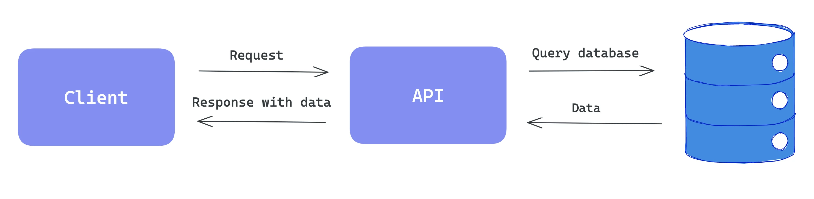
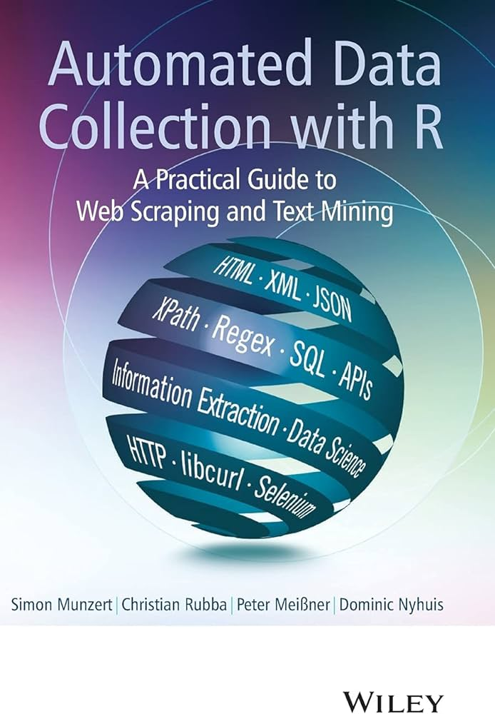
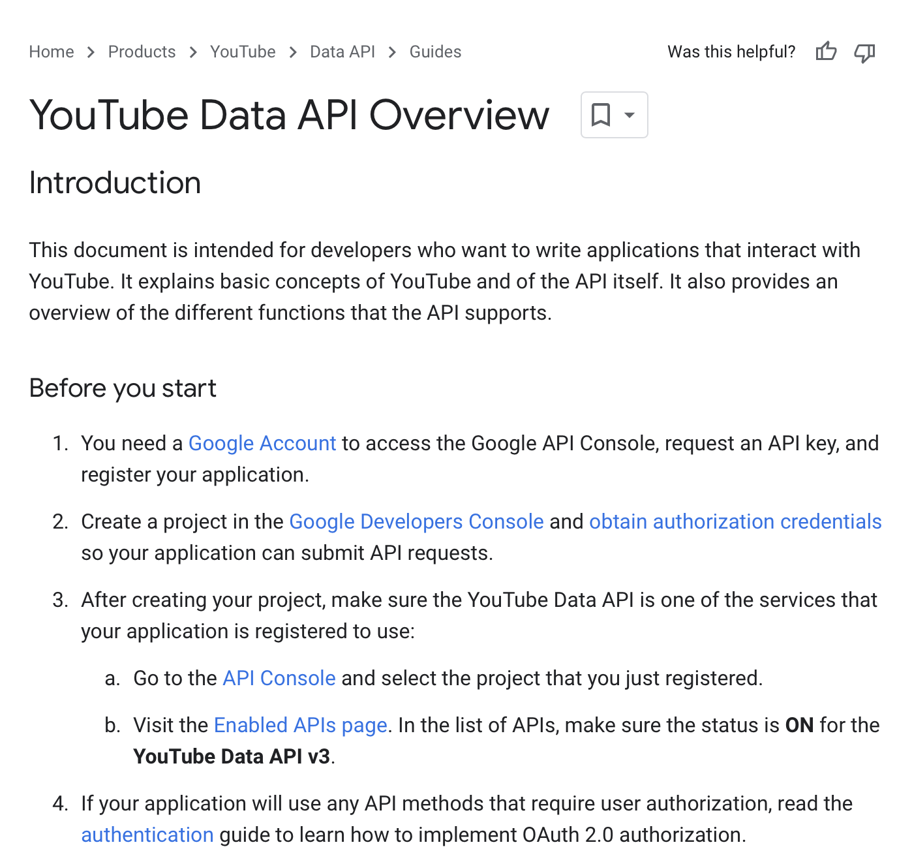
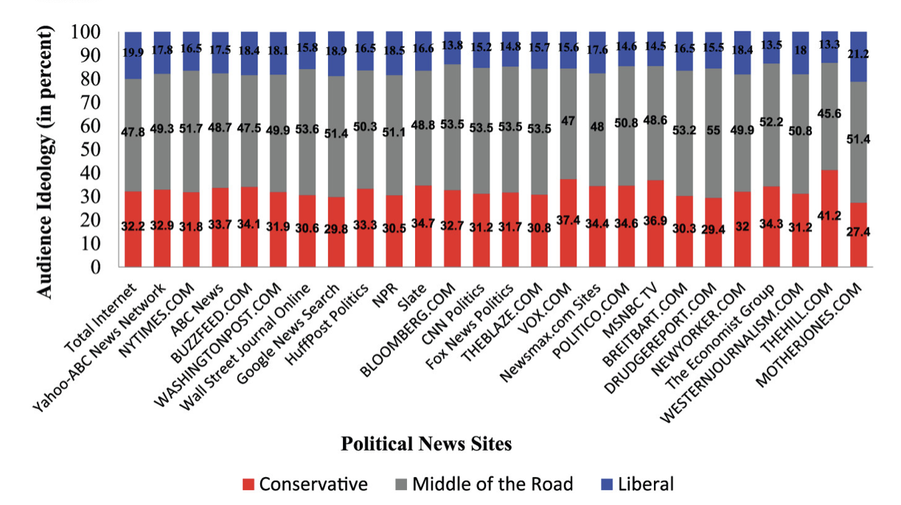
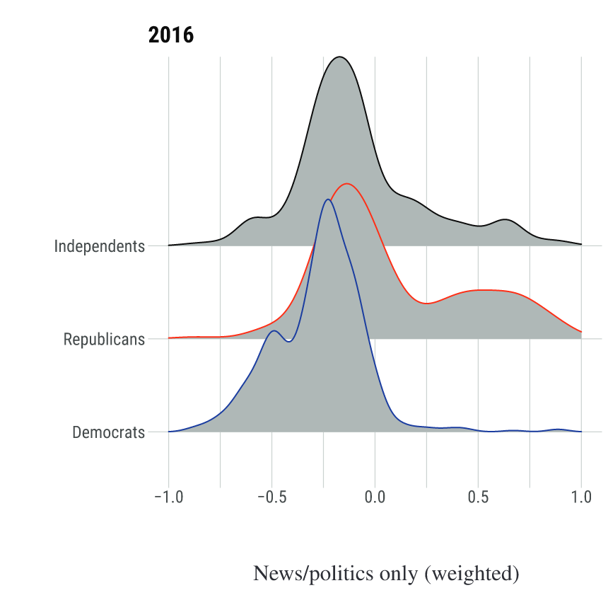

## Agenda for today

1. Getting data from APIs in *R* and data wrangling exercises

2. Designed digital data 

3. Exercises using web tracking data in *R*


##

```{r, echo=FALSE, warning=FALSE, out.width="105%", message=FALSE}
#| html-table-processing: none

library(openxlsx)
library(tidyverse)
library(gt)
library(gtExtras)
read.xlsx("../material/data/schedule_in_slides.xlsx") %>%
    rename(`Required reading` = "Required.reading") %>%
    head(7) %>% 
    gt() %>%
    tab_header(md("**Seminar dates and topics**")) %>%
    #tab_header("**Seminar dates and topics**") %>%
    #fmt_markdown() %>% #columns = TRUE
    # cols_width(Date ~ px(400)#,
    #            #Topics ~ px(350)#,
    #            #`Required reading` ~ px(400)
    #            ) %>%
    cols_width(Date ~ pct(20),
               Topics ~ pct(30),
               `Required reading` ~ pct(50)
               ) %>%
    tab_options(data_row.padding = px(3)) %>%
    tab_options(heading.title.font.size = 14,
                column_labels.font.weight = "bold",
                table.font.size = 12) %>%
     gt_highlight_rows(
     rows = 6,
     fill = "lightblue"
   ) %>%
  fmt_markdown() %>% 
  cols_align(
    align = "left",
    columns = everything()
  )


```


# 1. Getting data from APIs in *R* and data wrangling exercises {background-color="#58748F"} 


## How to collect web data

:::: {.columns}

::: {.column width="50%"}

**Application Programming Interfaces (APIs)**

{width=100%}

::: {style="font-size: 20%;"}
[https://ninetailed.io/blog/api-calls/](https://ninetailed.io/blog/api-calls/)
:::

{width=70%}
:::


::: {.column width="50%"}
**Web scraping**

{width=90%}

::: {style="font-size: 20%;"}
[https://www.faz.net/aktuell/politik/inland/bayern-muenchen-will-kita-foerderung-umstellen-19549912.html](https://www.faz.net/aktuell/politik/inland/bayern-muenchen-will-kita-foerderung-umstellen-19549912.html)
:::

:::


::::


## How does it look like in *R*?


:::: {.columns}

::: {.column width="50%"}

**APIs**


```{r, eval=FALSE, echo=TRUE}
library(academictwitteR)
tweets <- get_all_tweets(
    query = "#BlackLivesMatter",
    start_tweets = "2020-01-01T00:00:00Z",
    end_tweets = "2020-01-05T00:00:00Z",
    file = "blmtweets"
  )

```

{width=100%}

:::


::: {.column width="50%"}
**Web scraping**

```{r, eval=TRUE, echo=TRUE}
library(rvest)
url <- "https://rvest.tidyverse.org/articles/starwars.html"
html <- read_html(url)

section <- html |> html_elements("section")
head(section, 5)

```

:::


::::


## How to (still) collect web data


:::: {.columns}

::: {.column width="50%"}


{width=115%}

::: {style="font-size: 50%;"}
[https://paulcbauer.github.io/apis_for_social_scientists_a_review/](https://paulcbauer.github.io/apis_for_social_scientists_a_review/)
:::

:::


::: {.column width="50%"}

{width=70%}

::: {style="font-size: 50%;"}
[http://www.r-datacollection.com](http://www.r-datacollection.com)
:::

:::

::::


## Homework


[Browse through Bauer et al. and explore the options for collecting DBD. If you find the time, try a few of the proposed APIs and code snippets.]{style="color:red;"}

::: {style="font-size: 50%;"}
[https://bookdown.org/paul/apis_for_social_scientists/](https://bookdown.org/paul/apis_for_social_scientists/)
:::

<br>

- Which APIs did you try out?
- Which APIs/code still work?
- Did the data help shape your research ideas?


## Let's check out the YouTube API

:::: {.columns}

::: {.column width="55%"}

{width=100%}
:::

::: {.column width="45%"}


- You always have to register for an API; requirements differ widely
- [Registration and endpoint documentation](https://developers.google.com/youtube/v3/getting-started) for the YouTube API 
- Some APIs have rate limits, i.e., the number of free data requests is limited


:::

::::


## Let's get started
- Download file **2_data_wrangling.R** in [https://sebastianstier.com/ma_css26/material.html](https://sebastianstier.com/ma_css26/material.html)


# 2. Designed digital data {background-color="#58748F"}


## Linking digital behavioral data and surveys

{width=150%}

::: {style="font-size: 50%;"}
Resnick, P., Adar, E., & Lampe, C. (2015). What Social Media Data We Are Missing and How to Get It. [*The ANNALS of the American Academy of Political and Social Science*, 659(1), 192–206.](https://doi.org/10.1177/0002716215570006)

:::


## How to actually link DBD and surveys?

{fig-align="center"}

::: {style="font-size: 40%;"}
Stier, S., Breuer, J., Siegers, P., & Thorson, K. (2020). Integrating Survey Data and Digital Trace Data: Key Issues in Developing an Emerging Field. [*Social Science Computer Review*, 38(5), 503–516.](https://doi.org/10.1177/0894439319843669)

:::

. . . 

::: {style="font-size: 70%;"}
$\rightarrow$ The exact setup depends very much on the type of DBD and platform data that may be linked with surveys.

:::


## Example: political polarization

{fig-align="center"}

::: {style="font-size: 50%;"}
Conover, M., Ratkiewicz, J., Francisco, M., Goncalves, B., Menczer, F., & Flammini, A. (2011). [Political Polarization on Twitter. In *Proceedings of the 5th International AAAI Conference on Web and Social Media* (pp. 89–96). AAAI Publications.](https://doi.org/10.1609/icwsm.v5i1.14126)

:::

## Political polarization on Twitter, better conceptualized

{fig-align="center"}

::: {style="font-size: 37%;"}
Barberá, P., Jost, J. T., Nagler, J., Tucker, J. A., & Bonneau, R. (2015). [Tweeting From Left to Right: Is Online Political Communication More Than an Echo Chamber? *Psychological Science*, 26(10), 1531–1542.](https://doi.org/10.1177/0956797615594620)

:::


## Political polarization, using web browsing data

:::: {.columns}

::: {.column width="55%"}


{width=100%}

::: {style="font-size: 45%;"}
Nelson, J. L., & Webster, J. G. (2017). [The Myth of Partisan Selective Exposure: A Portrait of the Online Political News Audience. *Social Media + Society*, 3(3).](https://doi.org/10.1177/2056305117729314) 
:::


:::


::: {.column width="40%"}

{width=110%}

::: {style="font-size: 40%;"}
Guess, A. M. (2021). [(Almost) Everything in Moderation: New Evidence on Americans’ Online Media Diets. *American Journal of Political Science*, 65(4), 1007–1022.](https://doi.org/10.1111/ajps.12589)

:::

:::

::::


 
## Our two required readings


:::: {.columns}

::: {.column width="50%"}


{width=100%}

::: {style="font-size: 40%;"}
Mangold, F., & Stier, S. (2025). Overview of Working with Web Tracking Data. [*GESIS Guides to Digital Behavioral Data*, 23.](https://doi.org/10.60762/ggdbd25023.1.0)

:::

:::


::: {.column width="50%"}

{width=65%}

::: {style="font-size: 40%;"}

Silber, H., Breuer, J., Beuthner, C., Gummer, T., Keusch, F., Siegers, P., Stier, S., & Weiß, B. (2022). Linking Surveys and Digital Trace Data: Insights From two Studies on Determinants of Data Sharing Behaviour. [*Journal of the Royal Statistical Society Series A: Statistics in Society*, 185(Supplement_2), S387–S407.](https://doi.org/10.1111/rssa.12954)


:::

:::


::::


## Think-pair-share

1. Discuss the literature for today with your neighbor (5 min.)
2. What are the pros and cons of user-centered data collections, and web tracking specifically?
3. Share and discuss your results with the full class


# 3. Exercises using web tracking data in *R* {background-color="#58748F"} 

## The data we will use today

{width=70%}

::: {style="font-size: 40%;"}
Wojcieszak, M., Clemm Von Hohenberg, B., Casas, A., Menchen-Trevino, E., De Leeuw, S., Gonçalves, A., & Boon, M. (2022). Null effects of news exposure: A test of the (un)desirable effects of a 'news vacation' and 'news binging'. [*Humanities and Social Sciences Communications*, 9(1), 413.](https://doi.org/10.1057/s41599-022-01423-x)


:::

<br>


::: {style="font-size: 50%;"}

A toy browsing data set that is based on a real data set collected from a US sample in 2019, but reduced to fewer participants and slightly modified for reasons of anonymity (n_subjects = 100; n_visits = 2 million).

:::

## Let's get started
- Download file **3_web_tracking_exercises.R** in [https://sebastianstier.com/ma_css26/material.html](https://sebastianstier.com/ma_css26/material.html)


# See you on April 15th (after the Spring Break) {background-color="#58748F"} 

## References
