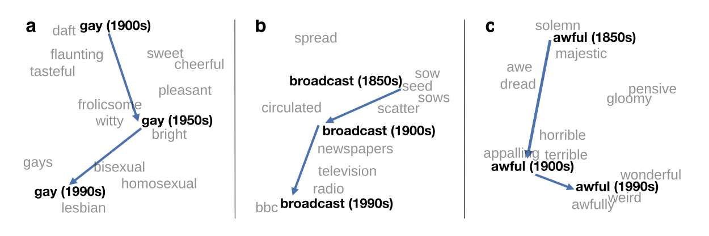

## Agenda for today

1. Web tracking data exercises in *R*

2. Large Language Models

3. Applied text analysis in *R*


##

```{r, echo=FALSE, warning=FALSE, out.width="105%", message=FALSE}
#| html-table-processing: none

library(openxlsx)
library(tidyverse)
library(gt)
library(gtExtras)
read.xlsx("../material/data/schedule_in_slides.xlsx") %>%
    rename(`Required reading` = "Required.reading") %>%
    tail(7) %>% 
    gt() %>%
    tab_header(md("**Seminar dates and topics**")) %>%
    #tab_header("**Seminar dates and topics**") %>%
    #fmt_markdown() %>% #columns = TRUE
    # cols_width(Date ~ px(400)#,
    #            #Topics ~ px(350)#,
    #            #`Required reading` ~ px(400)
    #            ) %>%
    cols_width(Date ~ pct(20),
               Topics ~ pct(30),
               `Required reading` ~ pct(50)
               ) %>%
    tab_options(data_row.padding = px(3)) %>%
    tab_options(heading.title.font.size = 14,
                column_labels.font.weight = "bold",
                table.font.size = 12) %>%
     gt_highlight_rows(
     rows = 2,
     fill = "lightblue"
   ) %>%
  fmt_markdown() %>% 
  cols_align(
    align = "left",
    columns = everything()
  )


```


# 1. Web tracking data exercises in *R* {background-color="#58748F"}

## Let's get started
- We continue in file **3_web_tracking_exercises.R** in [https://sebastianstier.com/ma_css26/material.html](https://sebastianstier.com/ma_css26/material.html)


# 2. Large Language Models {background-color="#58748F"}


## What are (Large) Language Models? {.incremental}

::: {style="font-size: 90%;"}
::: {.incremental}

1. An LLM is a system that **can predict the next word** based on previous words. An LLM is a machine that has learned the patterns of language so well that it can generate new text that fits those patterns. 
2. Computers don't understand words. The LLM turns a **word into a list of numbers (a vector)** that captures co-occurances. 
:::
:::

::: {style="font-size: 30%;"}
Jurafsky, D., & Martin, J. H. (2026). Speech and Language Processing: An Introduction to Natural Language Processing, Computational Linguistics, and Speech Recognition, with Language Models (3rd ed.). [https://web.stanford.edu/~jurafsky/slp3/](https://web.stanford.edu/~jurafsky/slp3)
:::


## From text to numbers: word-to-word matrix

{fig-align="center"}


## Word embeddings: adding more information to a word-to-word matrix

{fig-align="center"}

::: {style="font-size: 30%;"}
[https://www.scaler.com/topics/tensorflow/tensorflow-word2vwc/](https://www.scaler.com/topics/tensorflow/tensorflow-word2vwc/)

:::


## Word embeddings

{fig-align="center"}

::: {style="font-size: 50%;"}
[https://nlp.stanford.edu/projects/histwords/](https://doi.org/10.1177/0038038519853146)

:::


## Word embeddings

{fig-align="center"}

::: {style="font-size: 50%;"}
Bonikowski, B., Luo, Y., & Stuhler, O. (2022). Politics as Usual? Measuring Populism, Nationalism, and Authoritarianism in U.S. Presidential Campaigns (1952–2020) with Neural Language Models. [*Sociological Methods & Research*, 51(4), 1721–1787.](https://doi.org/10.1177/00491241221122317)

:::


## What are (Large) Language Models? 

::: {style="font-size: 90%;"}

1. An LLM is a system that **can predict the next word** based on previous words. An LLM is a machine that has learned the patterns of language so well that it can generate new text that fits those patterns. 
2. Computers don't understand words. The LLM turns a **word into a list of numbers (a vector)** that captures co-occurances. 

::: {.incremental}
3. **Attention**: For every word, the model decides which other words in the sentence are important for understanding it.
:::

:::


::: {style="font-size: 30%;"}
Jurafsky, D., & Martin, J. H. (2026). Speech and Language Processing: An Introduction to Natural Language Processing, Computational Linguistics, and Speech Recognition, with Language Models (3rd ed.). [https://web.stanford.edu/~jurafsky/slp3/](https://web.stanford.edu/~jurafsky/slp3)
:::

## Attention

::: callout-note
### One (exemplary) challenge: coreference resolution
The animal didn't cross the street because **it** was too tired.

The animal didn't cross the street because **it** was too wide.
:::

::: {style="font-size: 40%;"}
[https://research.google/blog/transformer-a-novel-neural-network-architecture-for-language-understanding](https://research.google/blog/transformer-a-novel-neural-network-architecture-for-language-understanding)
:::


## What are (Large) Language Models? 

::: {style="font-size: 90%;"}

1. An LLM is a system that **can predict the next word** based on previous words. An LLM is a machine that has learned the patterns of language so well that it can generate new text that fits those patterns. 
2. Computers don't understand words. The LLM turns a **word into a list of numbers (a vector)** that captures co-occurances. 
3. **Attention**: For every word, the model decides which other words in the sentence are important for understanding it.

::: {.incremental}
4. Language models consist of a **neural network** with many parameters (typically billions of weights).
5. Trained on **large quantities of unlabeled text using self-supervised learning**
:::

:::


::: {style="font-size: 30%;"}
Jurafsky, D., & Martin, J. H. (2026). Speech and Language Processing: An Introduction to Natural Language Processing, Computational Linguistics, and Speech Recognition, with Language Models (3rd ed.). [https://web.stanford.edu/~jurafsky/slp3/](https://web.stanford.edu/~jurafsky/slp3)
:::

## The basis of LLMs: neural networks

{fig-align="center"}

::: {style="font-size: 30%;"}
[https://research.google/blog/transformer-a-novel-neural-network-architecture-for-language-understanding](https://research.google/blog/transformer-a-novel-neural-network-architecture-for-language-understanding)
:::


## Training data

{fig-align="center"}

::: {style="font-size: 30%;"}

Gao, L., Biderman, S., Black, S., Golding, L., Hoppe, T., Foster, C., Phang, J., He, H., Thite, A., Nabeshima, N., Presser, S., & Leahy, C. (2020). The Pile: An 800GB Dataset of Diverse Text for Language Modeling (arXiv:2101.00027). [arXiv. https://doi.org/10.48550/arXiv.2101.00027](https://doi.org/10.48550/arXiv.2101.00027)
:::


## Our two required readings


1. Discuss the literature for today with your neighbor (5 min.)
2. Focus on the used methods, their pros and cons, and the disagreements between the papers
3. Share and discuss your results with the full class


## Main results from Gilardi. et al.


{fig-align="center"}

::: {style="font-size: 50%;"}
Gilardi, F., Alizadeh, M., & Kubli, M. (2023). ChatGPT outperforms crowd workers for text-annotation tasks. [*Proceedings of the National Academy of Sciences*, 120(30)](https://doi.org/10.1073/pnas.2305016120)


:::


# 3. Applied text analysis in *R* {background-color="#58748F"}

## We will use *quanteda* 
- Go to file **4_text_analysis.R** in [https://sebastianstier.com/ma_css26/material.html](https://sebastianstier.com/ma_css26/material.html)


# See you next week on April 29 {background-color="#58748F"} 

## References
