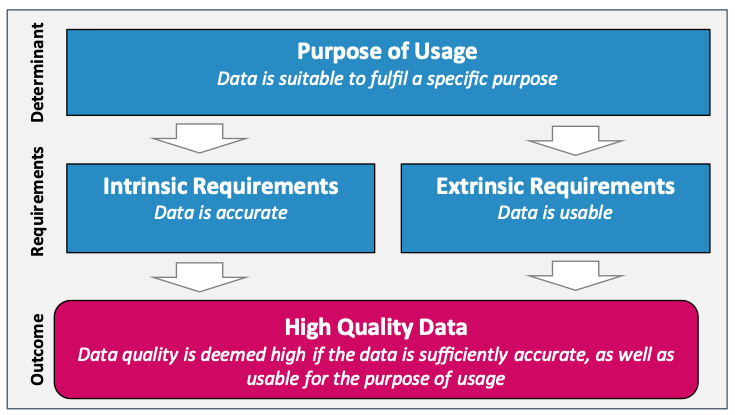

## Agenda for today

1. Seminar evaluation

2. Applied text analysis in *R*

3. Data quality in CSS

4. API-based data collection in *R*


##

```{r, echo=FALSE, warning=FALSE, out.width="105%", message=FALSE}
#| html-table-processing: none

library(openxlsx)
library(tidyverse)
library(gt)
library(gtExtras)
read.xlsx("../material/data/schedule_in_slides.xlsx") %>%
    rename(`Required reading` = "Required.reading") %>%
    tail(7) %>% 
    gt() %>%
    tab_header(md("**Seminar dates and topics**")) %>%
    #tab_header("**Seminar dates and topics**") %>%
    #fmt_markdown() %>% #columns = TRUE
    # cols_width(Date ~ px(400)#,
    #            #Topics ~ px(350)#,
    #            #`Required reading` ~ px(400)
    #            ) %>%
    cols_width(Date ~ pct(20),
               Topics ~ pct(30),
               `Required reading` ~ pct(50)
               ) %>%
    tab_options(data_row.padding = px(3)) %>%
    tab_options(heading.title.font.size = 14,
                column_labels.font.weight = "bold",
                table.font.size = 12) %>%
     gt_highlight_rows(
     rows = 3,
     fill = "lightblue"
   ) %>%
  fmt_markdown() %>% 
  cols_align(
    align = "left",
    columns = everything()
  )


```


# 1. Seminar evaluation {background-color="#58748F"}

## Let's take 7 minutes for the seminar evaluation

::: {style="font-size: 90%;"}

  *Please actively encourage your students to participate in the survey starting from April 15, and ideally allocate the     necessary time for completing the online questionnaire during your class (taking a maximum of 5 to 7 minutes).*

:::

# 2. Applied text analysis in *R* {background-color="#58748F"}

## Turning text into numbers

{fig-align="center"}

::: {style="font-size: 30%;"}
Benoit, K., Watanabe, K., Wang, H., Nulty, P., Obeng, A., Müller, S., Matsuo, A., Perry, P. O., Kuha, J., & Lauderdale, B. (2018). quanteda: An R package for the quantitative analysis of textual data. [*Journal of Open Source Software*, 3(30), 774.](https://joss.theoj.org/papers/10.21105/joss.00774)

:::


## We will use *quanteda* 
- Go to file **4_text_analysis.R** in [https://sebastianstier.com/ma_css26/material.html](https://sebastianstier.com/ma_css26/material.html)


# 3. Data quality in CSS {background-color="#58748F"}


## Data quality

- What are relevant dimensions of data quality?
- How do you assess data quality in your research?
- How do you ensure data quality in your research?


## Our two required readings

1. Discuss the literature for today with your neighbor (5 min.)
2. What are the most important data quality problems in CSS?
3. What can we do to mitigate data quality problems in CSS?


## Data quality: relevant dimensions



::: {style="font-size: 30%;"}

Birkenmaier, L., ... Ziaja, S. (2024). Defining and Evaluating Data Quality for the Social Sciences: Position Paper. [GESIS Papers.](https://doi.org/10.21241/SSOAR.96764)

:::


## What is a measurement?

. . . 

- A measurement is the process of linking an abstract concept to empirical indicators

- A measurement is typically an inference since we almost never observe "all data" perfectly. We use measurements to draw inferences based on incomplete/sampled data

## Drawing inferences: social sciences

{fig-align="center"}


## Drawing inferences: CSS

{fig-align="center"}


## Theory and causal mechanisms


{fig-align="center"}


## Applications to election prediction


{width=70%}


::: {style="font-size: 30%;"}

Tumasjan, A., Sprenger, T. O., Sandner, P. G., & Welpe, I. M. (2010). Predicting elections with Twitter: What 140 characters reveal about political sentiment. In: [*Proceedings of the 4th International AAAI Conference on Weblogs and Social Media* (pp. 178–185).](https://doi.org/10.1609/icwsm.v4i1.14009) 

:::

{width=70%}


::: {style="font-size: 30%;"}

Jungherr, A., Jürgens, P., & Schoen, H. (2012). Why the Pirate Party Won the German Election of 2009 or The Trouble With Predictions. [*Social Science Computer Review*, 30(2), 229–234.](https://doi.org/10.1177/0894439311404119)

:::


## The micro-macro link

{fig-align="center"}

::: {style="font-size: 50%;"}

Jungherr, A., Schoen, H., & Jürgens, P. (2016). The Mediation of Politics through Twitter: An Analysis of Messages posted during the Campaign for the German Federal Election 2013. [*Journal of Computer-Mediated Communication*, 21(1), 50–68.](https://doi.org/10.1111/jcc4.12143)

See also: Coleman, J. S. (1990). *Foundations of social theory*. Belknap Press of Harvard University Press.

:::


## An error framework perspective

{fig-align="center"}

::: {style="font-size: 50%;"}

Groves, R. M., & Lyberg, L. (2010). Total Survey Error: Past, Present, and Future. [*Public Opinion Quarterly*, 74(5), 849–879.](https://doi.org/10.1093/poq/nfq065)

::: 

## An error framework for DBD


{fig-align="center"}

::: {style="font-size: 50%;"}

Sen, I., Flöck, F., Weller, K., Weiß, B., & Wagner, C. (2021). A Total Error Framework for Digital Traces of Human Behavior on Online Platforms. [*Public Opinion Quarterly*, 85(S1), 399–422.](https://doi.org/10.1093/poq/nfab018)

::: 

## An error framework for DBD

- Can improve communication between different social science and CSS communities
- May help you to systematically reflect on the validity and reliability of your measurement
- But this framework is just a starting point! There are always research design and platform specific things to consider


# 4. API-based data collection in *R* {background-color="#58748F"}


## We will collect data-collection methods here 
- Go to file **5_data_collection.R** in [https://sebastianstier.com/ma_css26/material.html](https://sebastianstier.com/ma_css26/material.html)


## Homework

::: callout-note 
### Using *rollama* for calling LLMs from R
Install the R package *rollama*: [https://jbgruber.github.io/rollama](https://jbgruber.github.io/rollama/)

We'll discuss any potential problems next week.

Play around with some of the LLMs included in *rollama.*

:::


# See you next week on May 6 {background-color="#58748F"} 

## References
