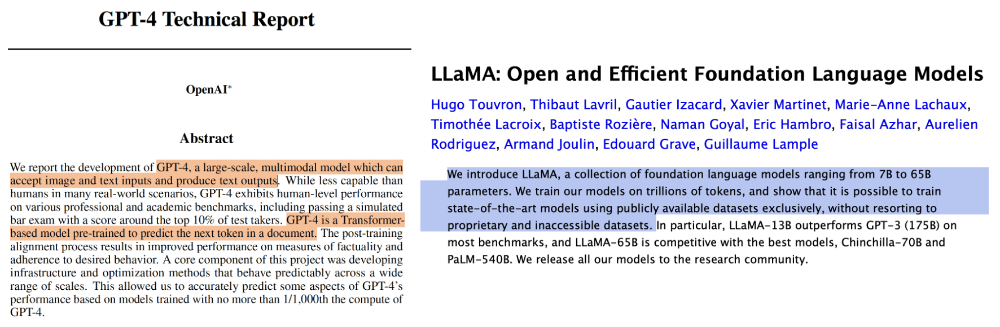
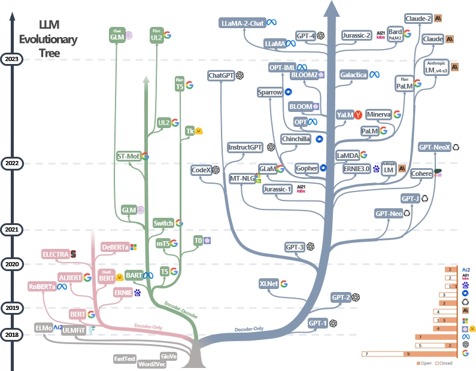
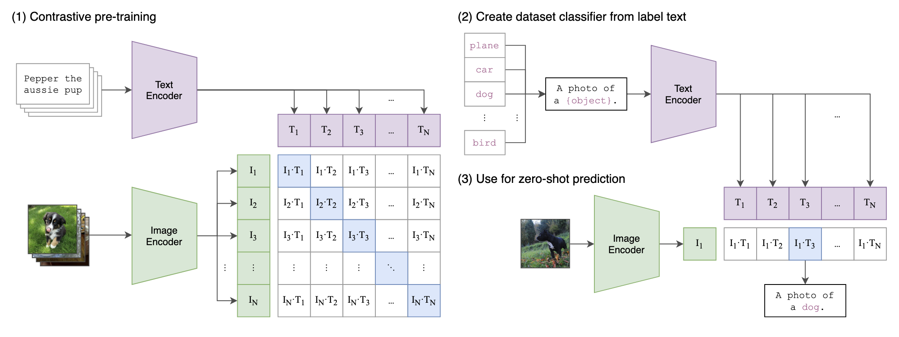
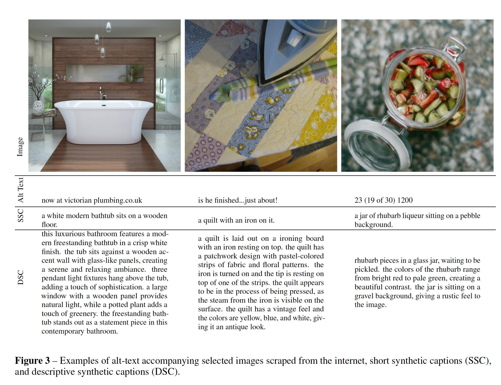

## Agenda for today

1. Large Language Models, continued

2. Applied text analysis in *R*

3. Open science and reproducibility in CSS


##

```{r, echo=FALSE, warning=FALSE, out.width="105%", message=FALSE}
#| html-table-processing: none

library(openxlsx)
library(tidyverse)
library(gt)
library(gtExtras)
read.xlsx("../material/data/schedule_in_slides.xlsx") %>%
    rename(`Required reading` = "Required.reading") %>%
    tail(7) %>% 
    gt() %>%
    tab_header(md("**Seminar dates and topics**")) %>%
    #tab_header("**Seminar dates and topics**") %>%
    #fmt_markdown() %>% #columns = TRUE
    # cols_width(Date ~ px(400)#,
    #            #Topics ~ px(350)#,
    #            #`Required reading` ~ px(400)
    #            ) %>%
    cols_width(Date ~ pct(20),
               Topics ~ pct(30),
               `Required reading` ~ pct(50)
               ) %>%
    tab_options(data_row.padding = px(3)) %>%
    tab_options(heading.title.font.size = 14,
                column_labels.font.weight = "bold",
                table.font.size = 12) %>%
     gt_highlight_rows(
     rows = 4,
     fill = "lightblue"
   ) %>%
  fmt_markdown() %>% 
  cols_align(
    align = "left",
    columns = everything()
  )


```


# 1. Large Language Models, continued {background-color="#58748F"}


## Recap: How do LLMs work? 

. . .

::: {style="font-size: 90%;"}

1. An LLM is a system that **can predict the next word** based on previous words. An LLM is a machine that has learned the patterns of language so well that it can generate new text that fits those patterns. 
2. Computers don't understand words. The LLM turns a **word into a list of numbers (a vector)** that captures co-occurances. 
3. **Attention**: For every word, the model decides which other words in the sentence are important for understanding it.
4. Language models consist of a **neural network** with many parameters (typically billions of weights).
5. Trained on **large quantities of unlabeled text using self-supervised learning**.

:::

::: {style="font-size: 30%;"}
Jurafsky, D., & Martin, J. H. (2026). Speech and Language Processing: An Introduction to Natural Language Processing, Computational Linguistics, and Speech Recognition, with Language Models (3rd ed.). [https://web.stanford.edu/~jurafsky/slp3/](https://web.stanford.edu/~jurafsky/slp3)
:::


## Recap: How do LLMs work? 




::: {style="font-size: 40%;"}
OpenAI, Achiam, J., Adler, S., Agarwal, S., Ahmad, L., Akkaya, I., Aleman, F. L., Almeida, D., Altenschmidt, J., Altman, S., Anadkat, S., Avila, R., Babuschkin, I., Balaji, S., Balcom, V., Baltescu, P., Bao, H., Bavarian, M., Belgum, J., … Zoph, B. (2024). [*GPT-4 Technical Report*.](https://arxiv.org/abs/2303.08774)

Touvron, H., Lavril, T., Izacard, G., Martinet, X., Lachaux, M.-A., Lacroix, T., Rozière, B., Goyal, N., Hambro, E., Azhar, F., Rodriguez, A., Joulin, A., Grave, E., & Lample, G. (2023). [LLaMA: Open and Efficient Foundation Language Models.](https://arxiv.org/abs/2302.13971)


:::


## Visualizations of word embeddings

[https://www.vectorvis.com/projector](https://www.vectorvis.com/projector)

[https://vectors.nlpl.eu/explore/embeddings/en/visual](https://vectors.nlpl.eu/explore/embeddings/en/visual)

[https://word-embeddings.wbkolleg.unibe.ch](https://word-embeddings.wbkolleg.unibe.ch)


## This field is evolving **quickly**

{fig-align="center"}

::: {style="font-size: 40%;"}
[https://github.com/Mooler0410/LLMsPracticalGuide](https://github.com/Mooler0410/LLMsPracticalGuide)

:::


## How to interact with LLMs

- **Zero shot learning**: the user writes a natural language instruction (commonly called "prompt") for the LLM that instructs it to perform a certain task
- **Few shot learning**: the user writes a prompt for the LLM that instructs it to perform a certain task + provides some examples
- **Instruction tuning**: the user trains a pre-trained model on task-related data. During fine tuning, model parameters are updated. A medium to large amount of labelled training data (i.e., examples that are annotated with the desired model output) is required.


## Multimodality and multilingual coverage

{fig-align="center"}

::: {style="font-size: 40%;"}

Bommasani, R., Hudson, D. A., Adeli, E., Altman, R., Arora, S., Arx, S. von, Bernstein, M. S., Bohg, J., Bosselut, A., Brunskill, E., Brynjolfsson, E., Buch, S., Card, D., Castellon, R., Chatterji, N., Chen, A., Creel, K., Davis, J. Q., Demszky, D., … Liang, P. (2022). On the Opportunities and Risks of Foundation Models (arXiv:2108.07258). [arXiv. https://doi.org/10.48550/arXiv.2108.07258](https://doi.org/10.48550/arXiv.2108.07258)

:::


## How do LLMs handle images?

::: {style="font-size: 70%;"}

- Scraping web images and their captions
- Extracting image features and comparing the patterns of occurence across images
- Using textual captions as image labels

::: 





::: {style="font-size: 40%;"}

Ramesh, A., Dhariwal, P., Nichol, A., Chu, C., & Chen, M. (2022). Hierarchical Text-Conditional Image Generation with CLIP Latents. [*OpenAI*.](https://arxiv.org/abs/2204.06125)

:::

## **DALL·E 3**




::: {style="font-size: 40%;"}

Betker, J., Goh, G., Jing, L., Brooks, T., Wang, J., Li, L., Ouyang, L., Zhuang, J., Lee, J., Guo, Y., Manassra, W., Dhariwal, P., Chu, C., & Jiao, Y. (2023). Improving image generation with better captions. [*OpenAI*.](https://cdn.openai.com/papers/dall-e-3.pdf)

:::


# 2. Applied text analysis in *R* {background-color="#58748F"}


## We will use *quanteda* 
- Go to the updated file **4_text_analysis.R** in [https://sebastianstier.com/ma_css26/material.html](https://sebastianstier.com/ma_css26/material.html)


## Homework

::: callout-note 
### Using *rollama* for calling LLMs from R
Install the R package *rollama*: [https://jbgruber.github.io/rollama](https://jbgruber.github.io/rollama/)

We'll discuss any potential problems next week.

Play around with some of the LLMs included in *rollama.*

:::


# 3. Open science and reproducibility in CSS {background-color="#58748F"}


## What is reproducibility?

::: callout-note 
### **Defining reproducibility**
A minimum standard on a spectrum of activities ("reproducibility spectrum") for assessing the value or accuracy of scientific claims **based on the original methods, data, and code**. [...] In some fields, this meaning is, instead, associated with the term "replicability" or "repeatability".
:::

::: {style="font-size: 50%;"}
[https://forrt.org/glossary/reproducibility](https://forrt.org/glossary/reproducibility)

:::

. . . 

Reproducibility ensures that research is **transparent, verifiable, and trustworthy**.


## Motivations for reproducibility
    
- Increasing the robustness and trustworthiness of your own research

- Facilitating collaboration (through the use of common tools and standards)

- Being kind to *future you*:
    - Editing and reusing your own code (e.g., for a paper revision or a follow-up study)
    - Easily being able to pick up a project after a break or finding and understanding things again after a longer time
    

## *The Turing Way* definition
    
{fig-align="center"}

    

::: {style="font-size: 50%;"}

[https://the-turing-way.netlify.app/reproducible-research/overview/overview-definitions.html](https://the-turing-way.netlify.app/reproducible-research/overview/overview-definitions.html)

:::
    
## Computational reproducibility


There also are distinctions between different types (or components) of reproducibility. One type/component that is especially relevant for our course is "computational reproducibility":

. . . 

::: {style="font-size: 82%;"}

> Ability to **recreate the same results as the original study** (including tables, figures, and quantitative findings), using the **same input data, computational methods, and conditions of analysis**. The availability of code and data facilitates computational reproducibility, as does preparation of these materials (annotating data, delineating software versions used, sharing computational environments, etc). Ideally, computational reproducibility should be achievable by another second researcher (or the original researcher, at a future time), using only a set of files and written instructions. 

::: 

::: {style="font-size: 30%;"}
[https://forrt.org/glossary/reproducibility](https://forrt.org/glossary/reproducibility)

:::


## The state of affairs

{width=60%}

::: {style="font-size: 50%;"}
Chan, C., Schatto-Eckrodt, T., & Gruber, J. B. (2024). What makes computational communication science (ir)reproducible? Computational Communication Research.

:::

::: {style="font-size: 70%;"}

**Take 3-5 minutes with your neighbor(s) to quickly recap the key findings of @chan_what_2024.**

:::


## Required reading: one of the "Facebook papers"

{fig-align="center"}

::: {style="font-size: 50%;"}
Nyhan, B., Settle, J., Thorson, E., Wojcieszak, M., Barberá, P., Chen, A. Y., Allcott, H., Brown, T., Crespo-Tenorio, A., Dimmery, D., Freelon, D., Gentzkow, M., González-Bailón, S., Guess, A. M., Kennedy, E., Kim, Y. M., Lazer, D., Malhotra, N., Moehler, D., … Tucker, J. A. (2023). Like-minded sources on Facebook are prevalent but not polarizing. [*Nature*, 620(7972), 137–144.](https://doi.org/10.1038/s41586-023-06297-w)

:::


    
## Tools & workflows
    
**Tools** are programming languages, scripts and other pieces of software that we use to make our research reproducible.

**Workflows** are the ways in which we combine these tools to achieve our goal.

. . . 

Choosing tools and establishing workflows are somewhat idiosyncratic processes that depend on...

- the requirements of your project (methods, data types, ...)

- the availability of tools

- your skills and knowledge

- the preferences of collaborators

    
## Research management practices
    
Being an open scientist means adopting a few straightforward research management practices, which lead to less error-prone, reproducible research workflows [@klein_practical_2018: 11]

- Using free and open source software (FOSS)
- [Project-oriented workflow](https://www.tidyverse.org/blog/2017/12/workflow-vs-script)
- [The *tidyverse* style guide](https://style.tidyverse.org)
- [Clear folder structures](https://psych-transparency-guide.uni-koeln.de/folder-structure.html)
- [Naming things](https://style.tidyverse.org/syntax.html)


# The role of open science in your term papers {background-color="#58748F"}

## Requirements for term paper

- Should be based on content/methods covered in the seminar: collection and analysis of DBD, use of CSS methods in *R*
- (4,000-5,000 words)
- Submission deadline: 31 July 2026 (**Prüfungsleistung/Examination**)
- Fully reproducible code, including narrative comments where you explain what you do in each step
    - You can share all materials, including data with me via [https://cryptshare.gesis.org](https://cryptshare.gesis.org)

## Format of term paper
- Motivation and research question
- Concise theoretical overview: for what conceptual and theoretical reasons do I choose these data and methods?
- Research design
- Data and variables
- Method: no detailed mathematical description needed, but why does this method fit my research question and my data?
- Results
- Interpretation and conclusions
- Analysis code as an R script: needs to be fully reproducible


## Presentations

- Short 5 minute elevator pitch of your ideas
- A structure with three slides could look like this
  1. Motivation, research question and theory
  2. Data source and data acquisition
  3. Current status / preliminary data collection / analysis


# See you next week on May 13 {background-color="#58748F"} 

## References
