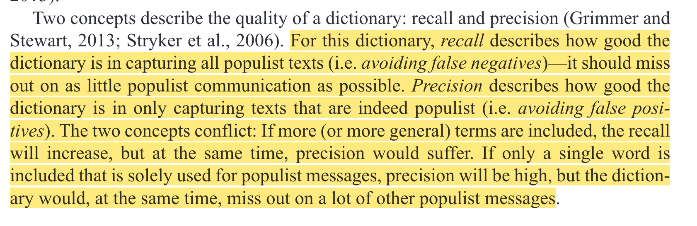

## Agenda for today

1. Writing a reproducible paper in *R*

2. Automated text analysis, continued

3. Network analysis in *R*


##

```{r, echo=FALSE, warning=FALSE, out.width="105%", message=FALSE}
#| html-table-processing: none

library(openxlsx)
library(tidyverse)
library(gt)
library(gtExtras)
read.xlsx("../material/data/schedule_in_slides.xlsx") %>%
    rename(`Required reading` = "Required.reading") %>%
    tail(7) %>% 
    gt() %>%
    tab_header(md("**Seminar dates and topics**")) %>%
    #tab_header("**Seminar dates and topics**") %>%
    #fmt_markdown() %>% #columns = TRUE
    # cols_width(Date ~ px(400)#,
    #            #Topics ~ px(350)#,
    #            #`Required reading` ~ px(400)
    #            ) %>%
    cols_width(Date ~ pct(20),
               Topics ~ pct(30),
               `Required reading` ~ pct(50)
               ) %>%
    tab_options(data_row.padding = px(3)) %>%
    tab_options(heading.title.font.size = 14,
                column_labels.font.weight = "bold",
                table.font.size = 12) %>%
     gt_highlight_rows(
     rows = 5,
     fill = "lightblue"
   ) %>%
  fmt_markdown() %>% 
  cols_align(
    align = "left",
    columns = everything()
  )


```


## Progress on data collection?


{width=115%}

::: {style="font-size: 50%;"}
[https://paulcbauer.github.io/apis_for_social_scientists_a_review/](https://paulcbauer.github.io/apis_for_social_scientists_a_review/)
:::

- Which APIs did you try out?
- Which APIs/code still work?
- Did the data help shape your research ideas?


# 1. Writing a reproducible paper in *R* {background-color="#58748F"}

    
## Computational reproducibility


::: {style="font-size: 90%;"}

> Ability to **recreate the same results as the original study** (including tables, figures, and quantitative findings), using the **same input data, computational methods, and conditions of analysis**. The availability of code and data facilitates computational reproducibility, as does preparation of these materials (annotating data, delineating software versions used, sharing computational environments, etc). Ideally, computational reproducibility should be achievable by another second researcher (or the original researcher, at a future time), using only a set of files and written instructions. 

::: 

::: {style="font-size: 30%;"}
[https://forrt.org/glossary/reproducibility](https://forrt.org/glossary/reproducibility)

:::


    
## Tools and workflows
    
**Tools** are programming languages, scripts and other pieces of software that we use to make our research reproducible.

**Workflows** are the ways in which we combine these tools to achieve our goal.

. . . 

Choosing tools and establishing workflows are somewhat idiosyncratic processes that depend on...

- the requirements of your project (methods, data types, ...)

- the availability of tools

- your skills and knowledge

- the preferences of collaborators


## Exploring *quarto*

- Together with your neighbor(s), explore the quarto logic and try to render your first quarto document as pdf and then as docx.

- The documentation of quarto can be found here: [https://quarto.org/docs/output-formats/pdf-basics.html](https://quarto.org/docs/output-formats/pdf-basics.html)
    
    
## Fully reproducible documents in *R*


::: {style="font-size: 57%;"}
Download the template (zip file) from GitHub: [https://github.com/paulcbauer/Writing_a_reproducable_paper_with_quarto](https://github.com/paulcbauer/Writing_a_reproducable_paper_with_quarto)
:::


# 2. Automated text analysis, continued {background-color="#58748F"}


## Automated text analysis: The menu of options


{fig-align="center"}

::: {style="font-size: 30%;"}
Grimmer, J., & Stewart, B. M. (2013). Text as Data: The Promise and Pitfalls of Automatic Content Analysis Methods for Political Texts. [*Political Analysis*, 21(3), 267--297.](https://doi.org/10.1093/pan/mps028)

:::


## The foundations of topic models
{fig-align="center"}

::: {style="font-size: 30%;"}
Blei, D. M. (2012). Probabilistic topic models. [*Communications of the ACM*, 55(4), 77–84.](https://doi.org/10.1145/2133806.2133826)

:::


## Topic models: an application

{fig-align="center"}

::: {style="font-size: 30%;"}
Stier, S., Posch, L., Bleier, A., & Strohmaier, M. (2017). When populists become popular: Comparing Facebook use by the right-wing movement Pegida and German political parties. [*Information, Communication & Society*, 20(9), 1365–1388.](https://doi.org/10.1080/1369118X.2017.1328519)

:::


## Topic models: validate, validate! [@grimmer_text_2013]

**Semantic validity**

{fig-align="center"}


## Topic models: validate, validate! [@grimmer_text_2013]

**Predictive validity**

{fig-align="center"}


## Topic models: validate, validate! 

Interactive exploration

{width=70%}

::: {style="font-size: 40%;"}

Sievert, C., & Shirley, K. (2014). LDAvis: A method for visualizing and interpreting topics. [*Proceedings of the Workshop on Interactive Language Learning, Visualization, and Interfaces*, 63–70.](https://nlp.stanford.edu/events/illvi2014/papers/sievert-illvi2014.pdf)

:::


## Application in *R* 

- Go to the updated file **4_text_analysis.R** in [https://sebastianstier.com/ma_css26/material.html](https://sebastianstier.com/ma_css26/material.html)


## Validation




::: {style="font-size: 40%;"}
Gründl, J. (2022). Populist ideas on social media: A dictionary-based measurement of populist communication. [*New Media & Society*, 24(6), 1481–1499.](https://doi.org/10.1177/1461444820976970)

:::

## Validation


::: {style="font-size: 40%;"}

[https://medium.com/weidagang/demystifying-precision-and-recall-in-machine-learning-6f756a4c54ac](https://medium.com/@weidagang/demystifying-precision-and-recall-in-machine-learning-6f756a4c54ac)
:::


# 3. Network analysis in *R* {background-color="#58748F"}


## Why study networks?

Conventional research methods are often individual-based and our models tend to model relations between variables. Yet nature and culture are oftentimes structured as networks:

- society
- brain (neural networks)
- organizations (who reports to whom)
- economies (who sells to whom)
- ecologies (who eats whom)
- Position within a network is important for predicting outcomes


## DBD and networks


::: {style="font-size: 50%;"}

Lietz, H., Wagner, C., Bleier, A., & Strohmaier, M. (2014). When Politicians Talk: Assessing Online Conversational Practices of Political Parties on Twitter. [In *Proceedings of the 8th International AAAI Conference on Weblogs and Social Media* (pp. 285–294). AAAI Press.](https://ojs.aaai.org/index.php/ICWSM/article/view/14521/14370)

:::


## Key terms

- `Node/vertex`: the units
- `Edges`: the connections between the nodes


## Levels of analysis

**Dyad level**  
Fundamental unit of network data collection  
("Does sharing offices lead to friendship?") 

**Node level**  
Aggregation of dyad level measurement  
("Do actors with more friends have a stronger immune system?")

**Network level**  
Assessing overall structure of a network  
("Does information diffuse faster in well-connected networks?")


## Relations: network edges

- Relational roles: family, coworkers, ...
- Interactions: sold to, talked to, helped, ...
- Flows: information, belief, money, ...


::: {style="font-size: 80%;"}

:::{.fragment}
**undirected**  
symmetric relation
:::

:::{.fragment}
**directed**  
asymmetric relation
:::

:::{.fragment}
**valued/weighted**  
strength of relation, frequency of contact, etc.
:::

:::{.fragment}
**signed**  
positive and negative relations
:::

:::{.fragment}
**or a mixture thereof**
:::

:::


## Goals of analysis

:::{.fragment}
**Network variables as independent variable / explanatory**  

> *Using network theory to explain the consequences of network properties*

social capital, brokerage, adoption of innovation
:::

:::{.fragment}
**Network variables as dependent variable / outcomes**  

> *Using ______ theory to explain the antecendents of a network*

homophily, balance theory
:::


## Credit where credit is due

Today, I was drawing heavily on course material of my colleagues Paul Bauer, Arnim Bleier, Johannes Breuer, David Schoch and Bernd Weiß. Their material is openly available on GitHub:

[https://github.com/jobreu/reproducible-research-gesis-2023](https://github.com/jobreu/reproducible-research-gesis-2023)

[https://schochastics.github.io/netAnaR2023](https://schochastics.github.io/netAnaR2023/#/title-slide)


## Network analysis in *R*

Go to file **6_network_analysis.R** in [https://sebastianstier.com/ma_css26/material.html](https://sebastianstier.com/ma_css26/material.html)


# See you on May 20 {background-color="#58748F"}

## References
